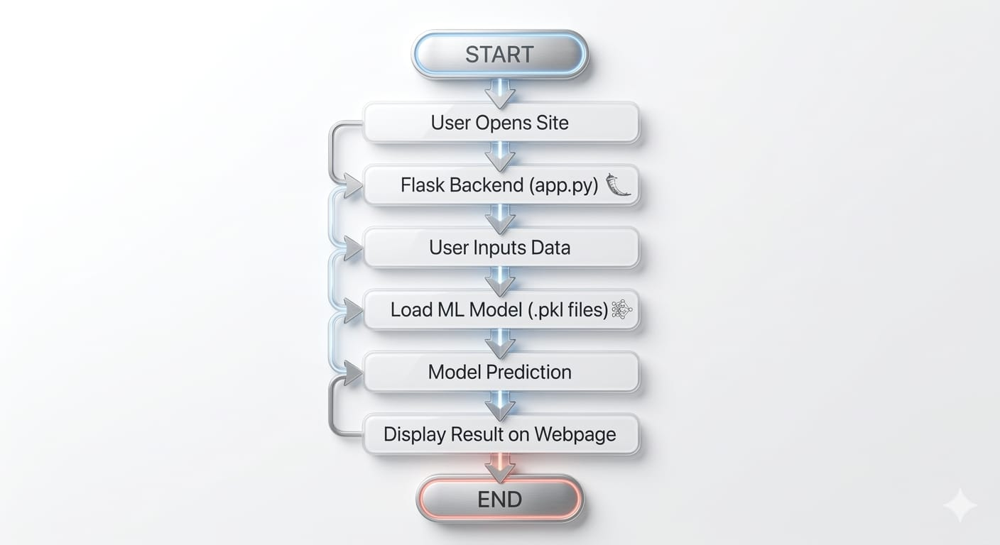
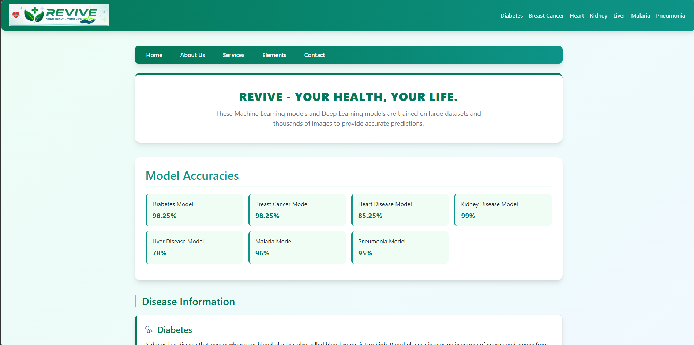
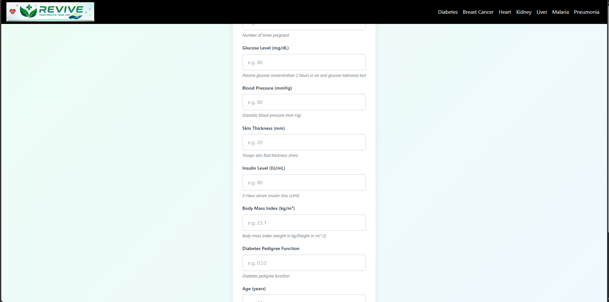
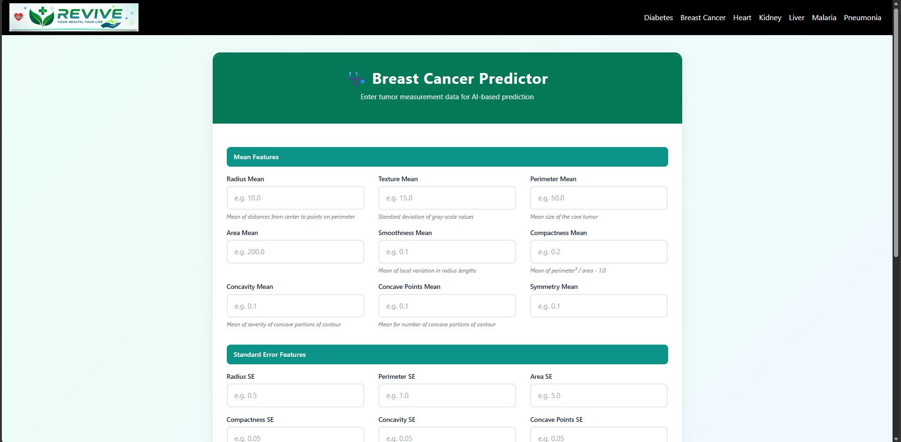
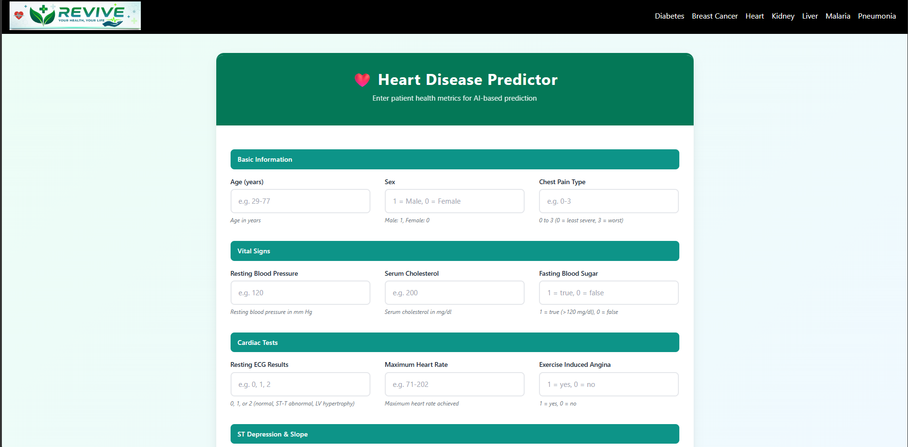
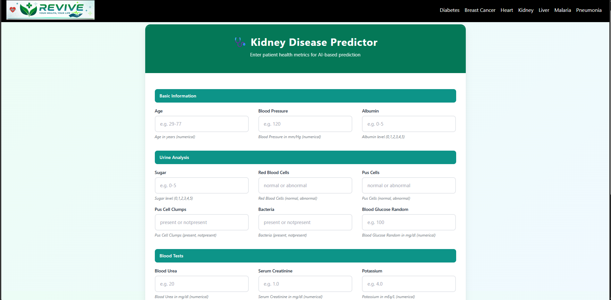
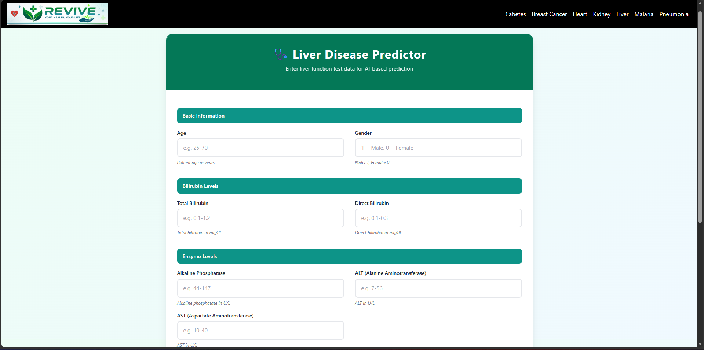
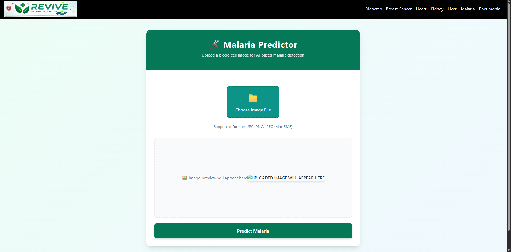
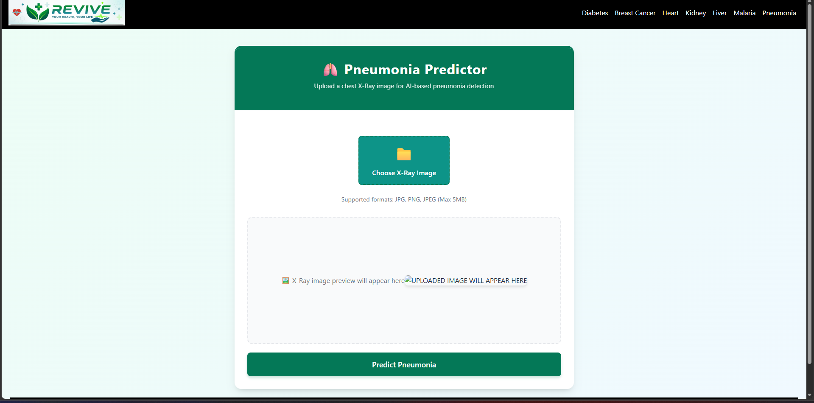
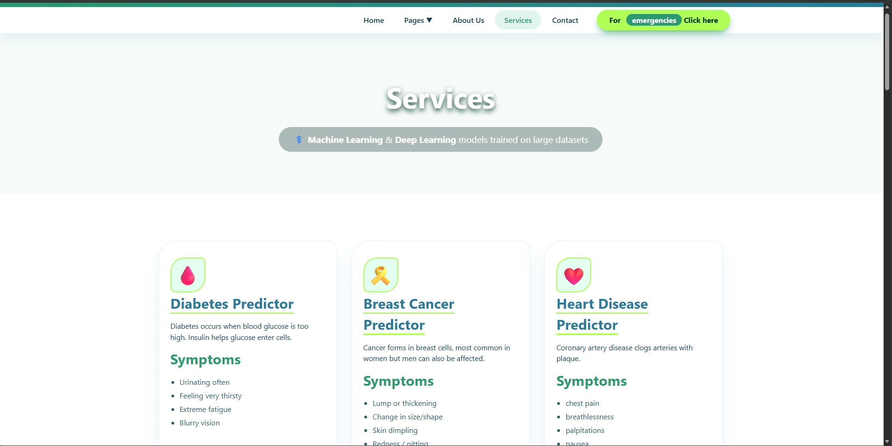

<p align="center">
  
#  Revive - A Machine Learnig model

</div>

<p align="center">
  
</p>

<p align="center">
Machine Learning Based Web Application for multiple Disease Prediction
</p>

---


---

#  Project Overview

**Revive** is a Machine Learning powered web application that predicts multiple diseases using patient medical data.

The system uses trained **Machine Learning and Deep Learning models** integrated with a **Flask web application**.

Users can enter medical parameters and the system will predict possible diseases based on trained datasets.

---

#  Features

✔ Multiple Disease Prediction  
✔ Machine Learning Models  
✔ Deep Learning Models  
✔ User Friendly Web Interface  
✔ Fast Prediction System  
✔ Accurate Results  

---

#  Table of Contents

- Problem Statement
- Why This Project
- Flow Chart
- Directory Structure
- Quick Start
- Screenshots
- Technical Details
- Developer
- License

---

#  Problem Statement

Revive can be time consuming and sometimes prone to human errors.

The objective of this project is to build a **Machine Learning based medical diagnosis system** that helps in predicting diseases early.

The system allows users to input medical data which is then processed by trained models to predict possible diseases.

This system helps:

- Doctors
- Medical Researchers
- Patients

to quickly identify possible diseases using AI.

---

#  Why This Project

Humans can make mistakes during diagnosis due to fatigue or workload.

Machine Learning systems analyze large datasets and identify patterns which help in improving prediction accuracy.

Advantages of this project:

• Early disease detection  
• Reduced diagnostic errors  
• Faster analysis  
• Multiple disease predictions  

Datasets were collected from **Kaggle** and **UCI Machine Learning Repository**.

---

#  Flow Chart

Start
  │
  ▼
  
User Opens Website
  │
  ▼
  
Flask Server Starts (app.py)
  │
  ▼
  
Homepage Loads (index.html)
  │
  ▼
  
User Selects Disease Prediction
(Malaria / Pneumonia / Kidney / Liver)
  │
  ▼
  
User Uploads Image / Enters Data
  │
  ▼
  
Flask Receives Input (POST Request)
  │
  ▼
  
Load Trained ML Model (.pkl)
  │
  ▼
  
Preprocess Input Data
  │
  ▼
  
Model Prediction
  │
  ▼
  
Prediction Result Generated
  │
  ▼
  
Result Sent to HTML Template
  │
  ▼
  
Result Displayed to User
  │
  ▼
  
End

### Visual FC

---

#  Quick Start

### Step 1

Clone the repository


git clone https://github.com/codexshami/Revive.git
##  Quick Start

### Step 1
Clone the repository

```bash
git clone https://github.com/codexshami/Revive
```

### Step 2
Go to project directory

```bash
cd Revive
```

### Step 3
Install dependencies

```bash
pip install -r requirements.txt
```

### Step 4
Run the application

```bash
python app.py
```

or

```bash
flask run
```

### Step 5
Open browser

```
http://127.0.0.1:5000
```

---

#  Screenshots
### Home



### Diabetes Prediction


### Breast Cancer Prediction


### Heart Disease Prediction


### Kidney Disease Prediction


### Liver Disease Prediction


### Malaria Detection


### Pneumonia Detection


### Services


---

#  Technical Details

This web application was developed using **Flask Web Framework**.

Machine Learning models were trained on large datasets and integrated into the web application.

The system can predict the following diseases:

- Diabetes
- Breast Cancer
- Heart Disease
- Kidney Disease
- Liver Disease
- Malaria
- Pneumonia

---

#  Model Accuracy

| Disease | Model Type | Accuracy |
|--------|------------|----------|
| Diabetes | Machine Learning | 98.25% |
| Breast Cancer | Machine Learning | 98.25% |
| Heart Disease | Machine Learning | 85.25% |
| Kidney Disease | Machine Learning | 99% |
| Liver Disease | Machine Learning | 78% |
| Malaria | CNN Deep Learning | 96% |
| Pneumonia | CNN Deep Learning | 95% |

---

#  Developer

**Mohd Shami**

 LinkedIn  
https://www.linkedin.com/in/codexshami

 GitHub  
https://github.com/codexshami

 Email  
codexshami@gmail.com

---

#  License

Licensed under the **Apache License 2.0**

```
Copyright 2026 Mohd Shami

Licensed under the Apache License, Version 2.0 (the "License");
you may not use this file except in compliance with the License.
You may obtain a copy of the License at

http://www.apache.org/licenses/LICENSE-2.0

Unless required by applicable law or agreed to in writing, software
distributed under the License is distributed on an "AS IS" BASIS,
WITHOUT WARRANTIES OR CONDITIONS OF ANY KIND.
```

<p align="center">
Made by Mohd Shami
</p>

